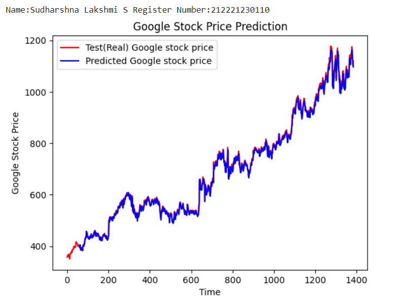
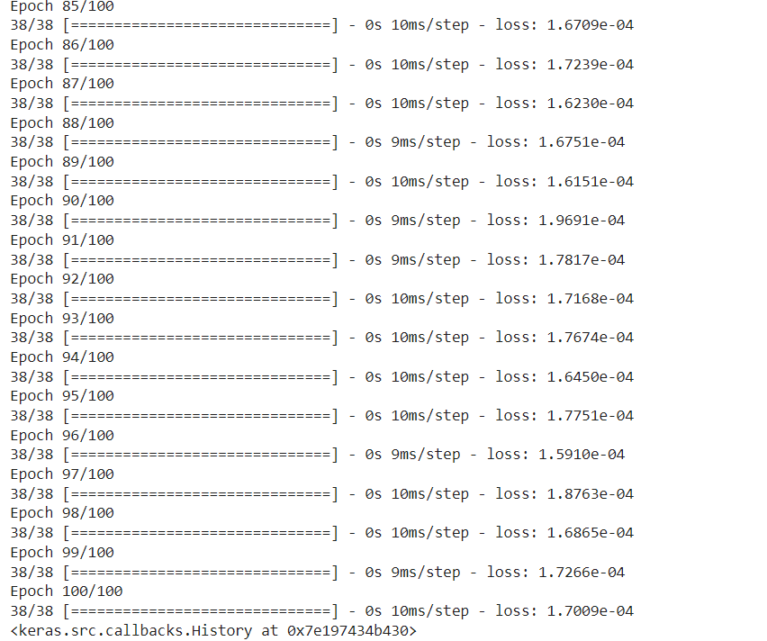

# Stock Price Prediction

## AIM

To develop a Recurrent Neural Network model for stock price prediction.

## Problem Statement and Dataset
Construct a Recurrent Neural Network (RNN) model to forecast Google's stock price. The objective is to use historical stock price data to train the model, and then use a different test dataset to assess its performance. By contrasting the model's output with the actual stock prices from the test dataset, the prediction accuracy of the model will be evaluated.
Datasets: There are two CSV files in the dataset:
Trainset.csv: The RNN model will be trained using historical Google stock price data found in this file. It contains details like the stock's initial price.
testset.csv: This file includes extra Google stock price historical data that will be used to evaluate the trained RNN model. In a similar vein, it contains details like the stock's opening price.
Both datasets have several columns, but for the purposes of this exercise, the only information that will be used to predict future stock prices is the opening price of the stock, also known as "Open."
The goal is to create a model that can efficiently identify trends in the training data and use those patterns to predict the test data with high accuracy.

## Design Steps

### Step 1: 
Prepare training data by scaling and creating sequences.
### Step 2: 
Add SimpleRNN and Dense layers after initializing a sequential model.
### Step 3: 
Use the Adam optimizer and mean squared error loss to compile the model.
### Step 4: 
Use the ready-made training data to train the model.
### Step 5: 
Use the trained model to make predictions, preprocess test data, and display the outcomes.

## Program
#### Name: Sudharshna Lakshmi S
#### Register Number: 212221230110
```
import numpy as np
import matplotlib.pyplot as plt
import pandas as pd
from sklearn.preprocessing import MinMaxScaler
from keras import layers
from keras.models import Sequential

dataset_train = pd.read_csv('trainset.csv')


dataset_train.columns

dataset_train.head()

train_set = dataset_train.iloc[:,1:2].values

type(train_set)

train_set.shape

sc = MinMaxScaler(feature_range=(0,1))
training_set_scaled = sc.fit_transform(train_set)

training_set_scaled.shape

X_train_array = []
y_train_array = []
for i in range(60, 1259):
  X_train_array.append(training_set_scaled[i-60:i,0])
  y_train_array.append(training_set_scaled[i,0])
X_train, y_train = np.array(X_train_array), np.array(y_train_array)
X_train1 = X_train.reshape((X_train.shape[0], X_train.shape[1],1))


X_train.shape

length = 60
n_features = 1

model = Sequential()
model.add(layers.SimpleRNN(45,input_shape=(length,n_features)))
model.add(layers.Dense(1))

model.compile(optimizer='adam', loss='mse')

print("Name:Sudharshna Lakshmi S Register Number: 212221230110")
model.summary()

model.fit(X_train1,y_train,epochs=100, batch_size=32)

dataset_test = pd.read_csv('testset.csv')

dataset_test.head()

test_set = dataset_test.iloc[:,1:2].values

test_set.shape

dataset_total = pd.concat((dataset_train['Open'],dataset_test['Open']),axis=0)

inputs = dataset_total.values
inputs = inputs.reshape(-1,1)
inputs_scaled=sc.transform(inputs)
X_test = []
for i in range(60,1384):
  X_test.append(inputs_scaled[i-60:i,0])
X_test = np.array(X_test)
X_test = np.reshape(X_test,(X_test.shape[0], X_test.shape[1],1))

X_test.shape

predicted_stock_price_scaled = model.predict(X_test)
predicted_stock_price = sc.inverse_transform(predicted_stock_price_scaled)

print("Name:Sudharshna Lakshmi S Register Number:212221230110")
plt.plot(np.arange(0,1384),inputs, color='red', label = 'Test(Real) Google stock price')
plt.plot(np.arange(60,1384),predicted_stock_price, color='blue', label = 'Predicted Google stock price')
plt.title('Google Stock Price Prediction')
plt.xlabel('Time')
plt.ylabel('Google Stock Price')
plt.legend()
plt.show()
```
## Output
### True Stock Price, Predicted Stock Price vs time


### Mean Square Error


## Result
Thus a Recurrent Neural Network model for stock price prediction is done.
